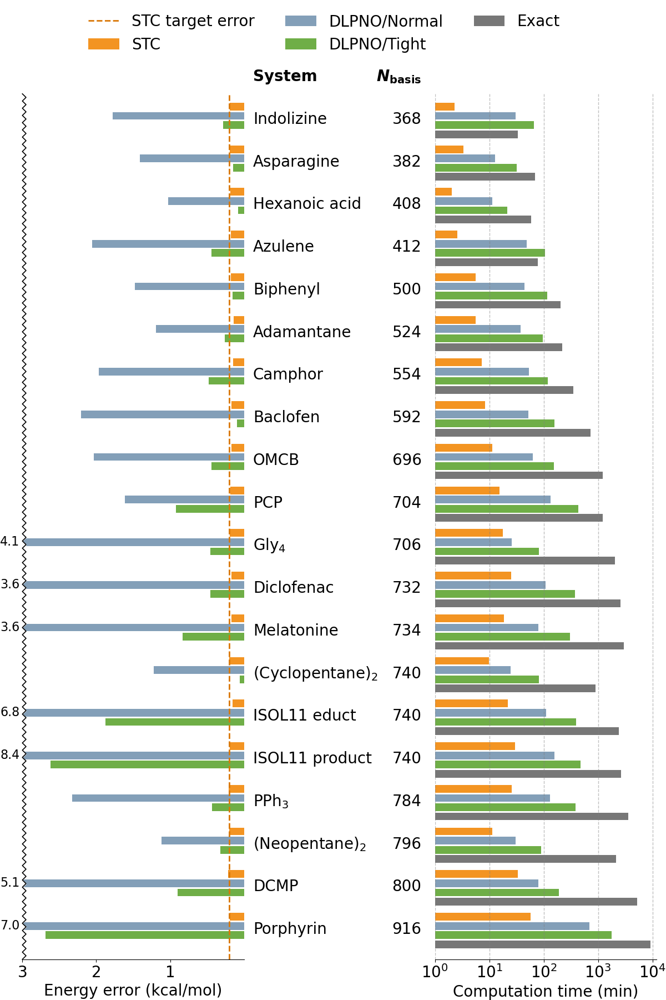

# Stochastic Tensor Contraction for Quantum Chemistry

Code accompanying [arXiv:2602.17158](https://arxiv.org/abs/2602.17158) by Jiace Sun and Garnet Kin-Lic Chan. This repository implements closed-shell STC-CCSD(T), which evaluates selected coupled-cluster tensor contractions by stochastic sampling to reduce their computational cost while controlling statistical error. Three variants are provided: canonical independent sampling, variance-optimized pure STC, and an optimized local-orbital implementation using quota sampling.

The implementation uses PyTorch in CPU-only, double-precision mode. Tensor-contraction kernels are compiled with `torch.compile` and TorchInductor, so the first calculation in a Python process includes compilation overhead.

## Installation

Python dependencies are `pyscf`, `numba`, `torch>=2.9`, `sympy`, and `threadpoolctl`. Install the package and its dependencies from the repository root:

```bash
python -m pip install .
```

## Quick start

Run an optimized STC-CCSD calculation for a water molecule from the `run` directory:

```bash
cd run
python stc_cc_general.py xyz/water/water1_min.xyz 6-31g 0.4 12 -method opt -diis 4 -shift 4
```

The positional arguments are the geometry, basis, target CCSD energy error in mH, and number of CCSD iterations. Add `-pt INTERVAL,NAVERAGE,ERROR` for the perturbative triples correction; use `--pbc` with a matching `.lattice` file for periodic calculations. Thread count is taken from `SLURM_JOB_CPUS_PER_NODE`, or otherwise from the available CPU count.

## Results represented in the paper



<!-- FIGURE: figures_and_results/figures/scaling.png — N_sample scaling behavior on water clusters -->
<!-- FIGURE: figures_and_results/figures/unbiaseness.png — unbiasedness verification on benzene -->
<!-- FIGURE: figures_and_results/figures/solid.png — solid-state STC-CCSD(T) results -->
<!-- FIGURE: figures_and_results/figures/locality.png — local orbital performance -->

The calculations include water clusters, benzene, periodic Si-doped diamond, PAH and H-hBN lattices, molecular benchmarks, and the ISOL24 reaction dataset.

## Repository structure

- `stc_cc/`: stochastic contraction, sampling, CCSD and (T), DIIS, orbital optimization, and PySCF interfaces.
- `run/`: calculation driver, orbital-localization script, geometries (`xyz/`), and iteration settings (`niters_benchmarking`, `niters_isol24`). See `run/xyz/INDEX.md` for the geometry layout.
- `figures_and_results/`: results and plotting, organized as:
  - `scripts/`: top-level plotting scripts (`main_plot_*.py`) plus shared `config.py` / `libformat.py`.
  - `data/`: processed data files consumed by the plotting scripts.
  - `figures/`: generated main-text figures (PNG/PDF).
  - `assets/`: input image assets (e.g. `hBN_3x5.png`).
  - `diagrams/`, `results_benchmarking/`, `SI/`: diagram sources, benchmarking computation, and supplementary-information plots.
  - `INDEX.md`: index of the plotting scripts and data files.

## Reproducing the paper results

Commands and calculation-specific notes are collected in [`run/commands_for_main_text_result_generation`](run/commands_for_main_text_result_generation). Run those commands from `run/`. The document records the target errors, iteration counts, averaging procedure, and JIT timing considerations used for each result; some molecule-specific iteration counts are stored in `run/niters_benchmarking` and `run/niters_isol24`.

## Citation

```bibtex
@article{sun2026stochastic,
  title         = {Stochastic Tensor Contraction for Quantum Chemistry},
  author        = {Sun, Jiace and Chan, Garnet Kin-Lic},
  year          = {2026},
  eprint        = {2602.17158},
  archivePrefix = {arXiv}
}
```

## License

This repository is distributed under the [MIT License](LICENSE). Copyright (c) 2026 Jiace Sun and Garnet Kin-Lic Chan.
